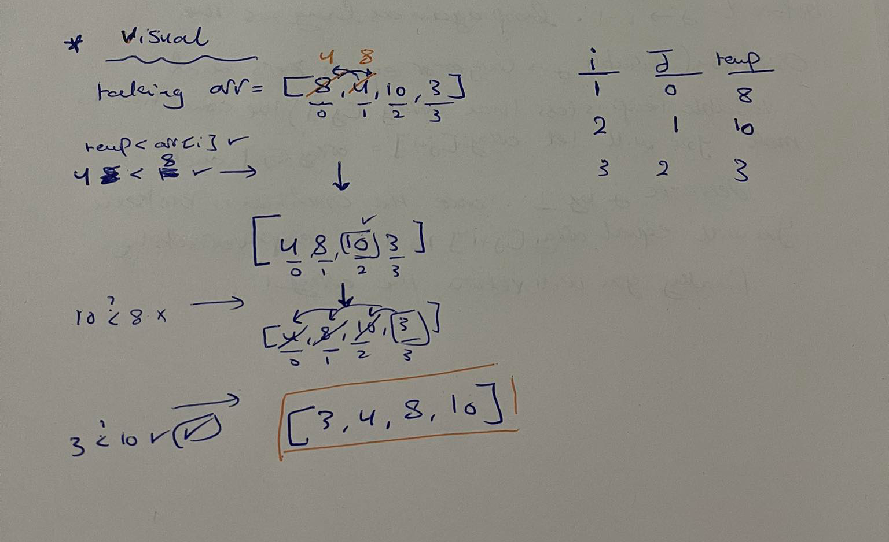

# InsertionSort

insertion Sort is a sorting algorithm that loops over the array and sorts it from the smallest to the largest element. each time it loops it checks the value of the element and compares it to the element before it which ever is smallest gets stored in the beginning and so on and finally it returns a sorted array. 
    

## Pseudocode

 InsertionSort(int[] arr)
  
    FOR i = 1 to arr.length
    
      int j <-- i - 1
      int temp <-- arr[i]
      
      WHILE j >= 0 AND temp < arr[j]
        arr[j + 1] <-- arr[j]
        j <-- j - 1
        
      arr[j + 1] <-- temp

   ## Trace  

   

Sample Array: [8,4,10,3]
note that
 8 --> index of 0
 4 --> index of 1
 10 --> index of 2
 3 --> index of 3 

 we loop over this array starting form index  1 in this case the value of it would 8, 
 we take this 8 and compare it with the value of index 0, if it is lower it be stored in index 0 and if not it will stay at it place until it is compared with another value and so on. 
 in the first iteration 4 is lower than 8 so it will be stored in index 0 and 8 will be stored in index 1 

`  we will have ---> [4,8,10,3]`

  in the second itration 10 will be compared with 8 
  it is not lower than 8 so it will stay at index 2 

 ` we will have ---> [4,8,10,3] `

  in the third itration, 3 will be compared with 10 it is lower than 10 so it will be stored in index 2 and 10 will be stored in index 3, 
  3 is then compared with 8 and it is lower so it will be stored in index 1 , it is also compared with 4 where it is lower so it will be stored in index 0 and for will be shifted to the next index 

 `   we will have ---> [3,4,8,10] `

 ## Efficency

big O of O(n^2)