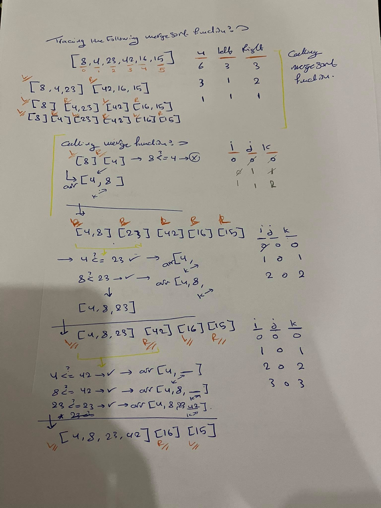
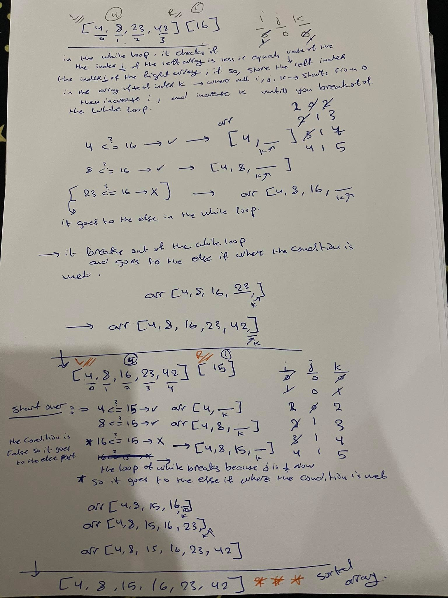

# MergeSort

Merge Sort is a sorting algorithm that loops over the array and in each itration it divides the array to halves using recension then it sorts each element in each half by comparing its value to the element in the second half until finally you end up with a sorted array. 

    

## Pseudocode

    ALGORITHM Mergesort(arr)
    DECLARE n <-- arr.length
           
    if n > 1
      DECLARE mid <-- n/2
      DECLARE left <-- arr[0...mid]
      DECLARE right <-- arr[mid...n]
      // sort the left side
      Mergesort(left)
      // sort the right side
      Mergesort(right)
      // merge the sorted left and right sides together
      Merge(left, right, arr)

    ALGORITHM Merge(left, right, arr)
    DECLARE i <-- 0
    DECLARE j <-- 0
    DECLARE k <-- 0

    while i < left.length && j < right.length
        if left[i] <= right[j]
            arr[k] <-- left[i]
            i <-- i + 1
        else
            arr[k] <-- right[j]
            j <-- j + 1
            
        k <-- k + 1

    if i = left.length
       set remaining entries in arr to remaining values in right
    else
       set remaining entries in arr to remaining values in left

   ## Trace  
   
   
      

Sample Array: `[8,4,23,42,16,15]`
note that
 `8 --> index of 0
 4 --> index of 1
 23 --> index of 2
 42 --> index of 3 
 16 --> index of 4
 15 --> index of 5`

 this array is of the length  6, 
 its mid point will be at index 3. 

 first we loop over the over the sample array and then we divide it into two halves 
 right and left 

 the right array will be of length 3 and it will contain [8,4,23]

 the left array will also be of length 3 and it will contain [42,16,15]

 using recursion the each half would be divided again until you end up with 
 `[8], [4], [23], [42], [16], [15]`

 passing two arrays at a time where one of them is left and the other is right and sorting them out 

 each time you call the merge function you will start with 

 `i --> 0
 j --> 0 
 k --> 0 `

 first taking [8] as left and [4] as left 
 we will check the while loop condition  where index i of the left array is less or equals the index i of the right array, if so store the value of the left index in the array you have. 
 i and j and k increase in each itration

 if the while loop condition is true check if 
 8 is equals or less than 4, this will be false so you will move to the else part 
 where you will  store 4 in the array you have and increase j and k by 1 then store 8 
  you will have -----> [4,8] as the new left array 

  `[4,8] , [23], [42], [16], [15]
`
  in the second itration 
  [4,8] will be left and [23] will be right 

 `and reset
 i --> 0
 j --> 0 
 k --> 0 
`
 check if 
 4 is equal to or less than 23 ----> true
 arr[4, ]
 k and i will be increased by one
 then loop again and check if 
 8 is equal to or less than 23 ----> true 
 arr [4,8,23]

  you will have -----> [4,8,23] as the new left array 

  `[4,8,23], [42], [16], [15]`

   in the third itration 
  [4,8,23] will be left and [42] will be right 
`
 and reset 
 i --> 0
 j --> 0 
 k --> 0 
`
check if 
 4 is equal to or less than 42 ----> true
 arr[4, ]
 k and i will be increased by one
 then loop again and check if 
 8 is equal to or less than 42 ----> true
 k and i will be increased by one
 then loop again and check if
23 is equal to or less than 42 ----> true
 k and i will be increased by one

 here the condition of the while loop will evaluate to false so you will go to the if condition and set the next index of the array to equal the index of the right array 
 array [4,8,23,42]

 you will have -----> [4,8,23,42] as the new left array 

 ` [4,8,23,42],[16], [15]`
  
  in the forth itration 
  [4,8,23,42] will be left and [16] will be right. 

  and so on 
  trace the steps in the pictures for a better clarification. 

 ## Efficency

big O of log(n)