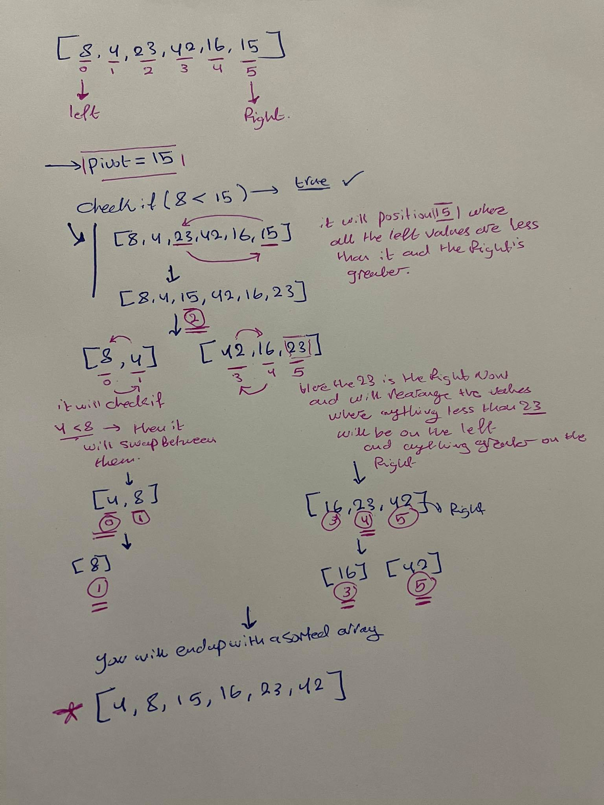

# Quick-Sort 
 a sorting algorithm that loops over the array and in each itration it divides the array and 
 it picks an element as pivot and partitions the given array around the picked pivot. Where it would rearrange the array where all the items that are less than tha pivot value will be the left part and anything grater will be right. 

 ## Pseudocode 

 ALGORITHM QuickSort(arr, left, right)
    if left < right
        // Partition the array by setting the position of the pivot value 
        DEFINE position <-- Partition(arr, left, right)
        // Sort the left
        QuickSort(arr, left, position - 1)
        // Sort the right
        QuickSort(arr, position + 1, right)

ALGORITHM Partition(arr, left, right)
    // set a pivot value as a point of reference
    DEFINE pivot <-- arr[right]
    // create a variable to track the largest index of numbers lower than the defined pivot
    DEFINE low <-- left - 1
    for i <- left to right do
        if arr[i] <= pivot
            low++
            Swap(arr, i, low)

     // place the value of the pivot location in the middle.
     // all numbers smaller than the pivot are on the left, larger on the right. 
     Swap(arr, right, low + 1)
    // return the pivot index point
     return low + 1

ALGORITHM Swap(arr, i, low)
    DEFINE temp;
    temp <-- arr[i]
    arr[i] <-- arr[low]
    arr[low] <-- temp

    ## Trace 

   

   arr[] = {8,4,23,42,16,15}

   left = 0
   right = 5
   pivot = arr[5]---> 15

   low = -1 

   check if left < right ---> if(8<15)
   loop where i = -1 to 5 
   check if arr[i]<= pivot ----> if (8<=15)---->true 
   you will increment low ----> low = 0 
   you will call the swap function 
   and swap arr[i] with [low]---> in this itration nothing will happen 

   next
   i = 1 
   it would  take 4 checks if it is less than 15 
   low will increase by 1 and the swap function would be called again swap arr[i] with [low]---> in this itration nothing will happen . 

   next 
   i =2 
   it would take 24 
   checks if 24 < than 15 ----> false 
   it wont implement the if function 

   next 
   i = 3 
   it would take 42 
   checks if 42 < than 15 ----> false 
   it wont implement the if function 

   next 
   i = 4 
   it would take 16 
   checks if 15 < than 15 ----> false 
   it wont implement the if function 

   next 
   i = 5 -----> the condition for the loop is false , the loop will be broken 

after that pivot will equal 23 now 
the items of the array will be rearranged where all the elements that are less than 23 will be on the left and anything grater will be on the right 
 we will increase low by one and call the recursion for the quick sort and so on 

 at the end you will end up with 
 arr[4,8,15,16,23,42]

## Efficency

Big O 

space complexity for the quick sort is O(n)

time complexity for the quick sort is O(nlogn)
here it is evaluated to nlogn because we have recursion and the partition 

   

