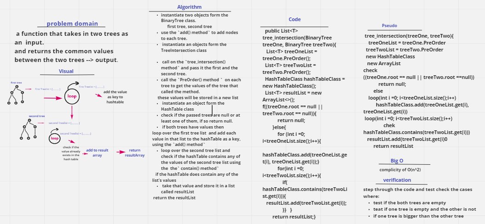

# Challenge Summary
 a function that takes in two trees as an  input.
and returns the common values between the two trees --> output. 

## Whiteboard Process

## Approach & Efficiency
 Big(O)

 - this method has the time complicity of O(n^2)
 for the fist part of the code it loops over the first tree list  n times --> o(n)
 then it loops over the second list values --> n times. 
 this gives an O(n)
 in the second part of the code, it calls the hashTable which takes an O(1)

 so for the whole code it would be O(n^2). 

## Solution
first you will` instantiate two objects form the BinaryTree class.` 
1. first tree
2. second tree 

 use the `add() method` to add nodes to each tree.

you will ` instantiate an objects form the TreeIntersection class`

use this object to call on the `tree_intersection() method` and pass it the first and the second tree. 

call the `PreOrder() method `  on each tree to get the values of the tree that called the method. 
the values will be in the order of (Root, Left, Right). 
these values will be stored in a new list 

you will `instantiate an object form the HashTable class`.
you will check if the passed trees are null or at least one of them, if so return null. 
if both trees have values then, 
loop over the first tree list  and add each value in that list to the hashTable as a key, (the value will also be the value in the list) using the `add() method`   

loop over the second tree list and check if the hashTable contains any of the values of the second tree list using the  the` contain() method` 
if the hashTable does contain any of the  list's values
you will take that value and store it in a list called resultList
at the end return the resultList 

