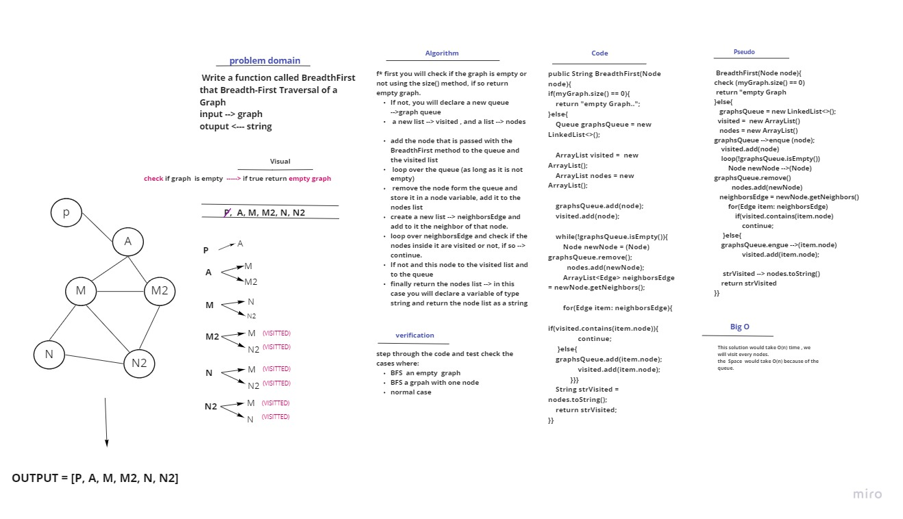
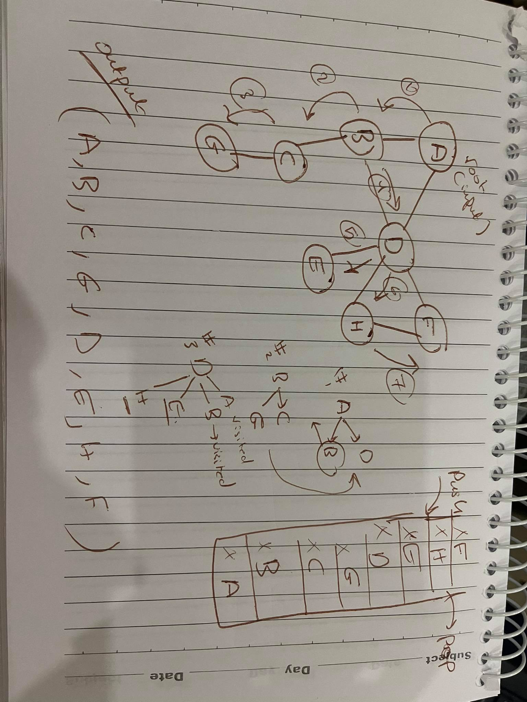
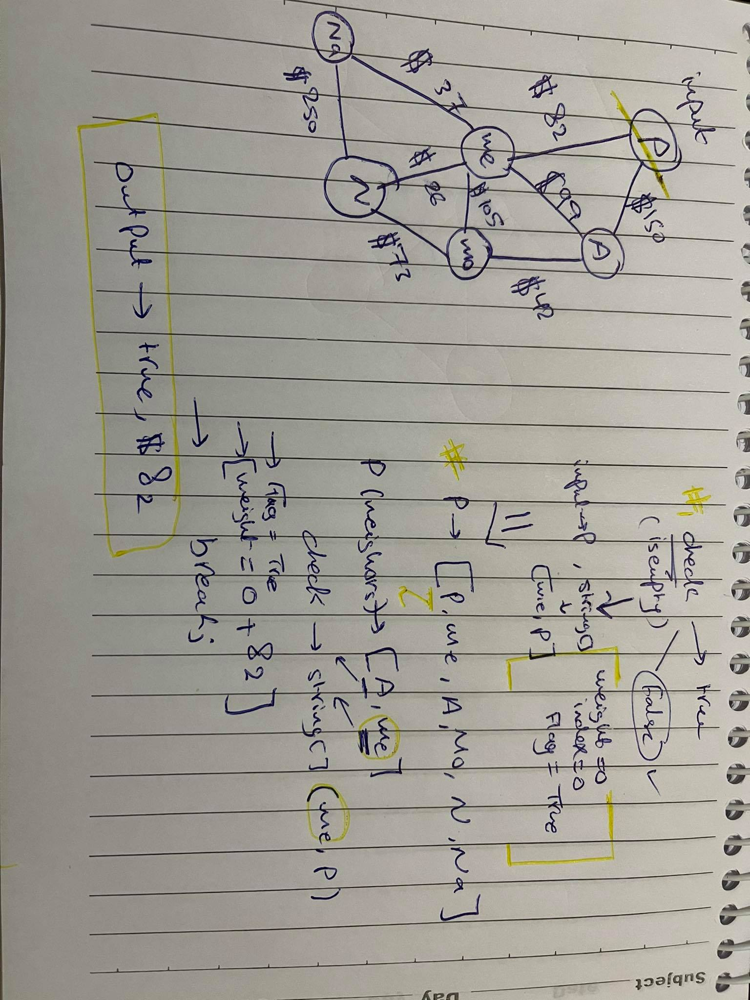

# Graphs

## Challenge
  create a Graph. The graph should be represented as an adjacency list, and should include the following methods:

   `AddNode()`
- `AddEdge()` 
- `GetNodes()` 
- `GetNeighbors()`
- `Size()`

## Approach & Efficiency
big O 

- `AddNode()` method --> O(1)
- `AddEdge()` --> O(1)
- `GetNodes()` --> O(1)
- `GetNeighbors()`--> O(1)
- `Size()`-->O(1)

## API

- `AddNode()` method 
Adds a new node to the graph, takes in a value and adds it to the graph 

- `AddEdge()`
Adds a new edge between two nodes in the graph
Include the ability to have a “weight”
Takes in the two nodes to be connected by the edge
checks both nodes are in the Graph
checks if  it doesn't have a weight
it adds an edge between them , it instantiate a new edge and pass it the value of the second node 
then it  adds an edge between the first and the second 

- `GetNodes()`
Returns all of the nodes in the graph as a collection 
checks first if the graph has nodes using the size method then returns the graph  

- `GetNeighbors()`
Returns a collection of edges connected to the given node and their weights

 it checks using the `getneighbors` method if it has neighbors or not
 aka  checks  if the check node has any neighbors return them

- `Size()`
Returns the total number of nodes in the graph

> # Code Challenge: Class 36
 

 # Challenge Summary
Implement a breadth-first traversal on a graph.

## Whiteboard Process

## Approach & Efficiency
This solution would take O(n) time , we will visit every nodes.
the  Space  would take O(n) because of the queue.

## Solution

first you will check if the graph is empty or not using the size() method, if so return empty graph. 
If not, you will declare a new queue -->graph queue 
and a new list --> visited , and a list --> nodes 

you will add the node that is passed with the  BreadthFirst method to the queue and the visited list 
then you will loop over the queue (as long as it is not empty)
you will remove the node form the queue and store it in a node variable, add it to the nodes list 
create a new list --> neighborsEdge and add to it the neighbor of that node. 
loop over neighborsEdge and check if the nodes inside it are visited or not, if so --> continue. 
If not and this node to the visited list and to the queue 
finally return the nodes lits --> in this case you will declare a variable of type string and return the node list as a string 

> # Depth first

# Challenge Summary
depth first preorder traversal on a graph

## Whiteboard Process

## Approach & Efficiency

This solution would take O(n) time , we will visit every nodes.
the  Space  would take O(n) because of the stack.

## Solution
first you will check if the graph is empty or not using the size() method, if so return empty graph. 
If not, you will declare a new stack -->`graphStack `
and a new list --> visited 

you will push the node that is passed with the DepthFirst  method to the stack and add it to visited list 

then you will loop over the stack (as long as it is not empty)
you will pop the node form the stack and store it in a node variable
create a new list --> neighborsEdge and add to it the neighbor of that node. 
loop over neighborsEdge and check if the nodes inside it are visited or not, if so --> continue. 

If not add this node to the visited list and push it to the stack 
finally return the visited  lits --> in this case you will declare a variable of type string and return the node list as a string 

> # challenge-37 

# Challenge Summary
Write a function based on the specifications above, which takes in a graph, and an array of city names and return whether the full trip is possible with direct flights, and how much it would cost.
input ---> graph, ArrayList<Strings>
output < ----- String 

## Whiteboard Process

## Approach & Efficiency
worst case: 

complexity -->

* time: 
if all the conditions are true, you will end up with O(n^2)  
three nested loops but with a condition so in the average case some of the condition wont be met. 

* space: 
O(1)
only declared constant variables 
## Solution

first we created a new class and called it GetEdge. 
then we declared an 
 index, weight with the initial value of 0, and a flag with a value of true. 

 check if the graph is empty ro not, if so ---> return **empty graph** 
 If not, 
 loop over the Cities ArrayList as log as the index is less than it size (equals the number od indices it has) and the flag is true, 
set the flag to false, 
get all the nodes in the graph, with each node you will check if its value equals the values in the Cities ArrayList, if so, get the neighbors of that node and loop over them
for each neighbor take its value and check if it is equal to next index in the cities ArrayList, if so
set flag to true
sum the weight between the neighbor nodes and break out of the loop and increment the index and start again form the next index until you are finished 

if not, loop until you have searched all the neighbors and all the cities and all the nodes 

finally 
you will check if the flag is true or not, 
if so --> 
return the string "true " plus the weight you have 
if not return "false" and 0
