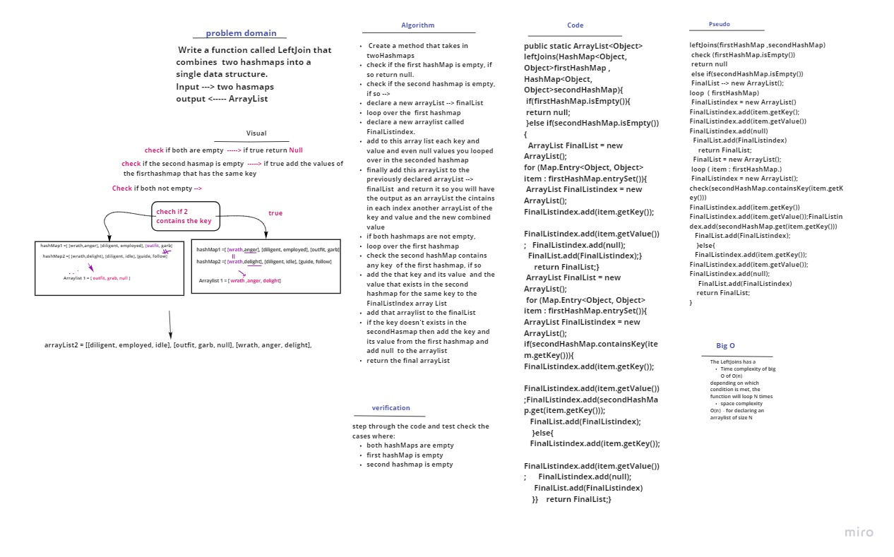

# Hashmap LEFT JOIN

## Challenge
Write a function that LEFT JOINs two hashmaps into a single data structure.
The first parameter is a hashmap that has word strings as keys, and a synonym of the key as values.
The second parameter is a hashmap that has word strings as keys, and antonyms of the key as values.
Combine the key and corresponding values (if they exist) into a new data structure according to LEFT JOIN logic.
LEFT JOIN means all the values in the first hashmap are returned, and if values exist in the “right” hashmap, they are appended to the result row. If no values exist in the right hashmap, then some flavor of NULL should be appended to the result row.
The returned data structure that holds the results is up to you. It doesn’t need to exactly match the output below, so long as it achieves the LEFT JOIN logic.
Avoid utilizing any of the library methods available to your language.

## Approach & Efficiency
 Create a method that takes in twoHashmaps
check if the first hashMap is empty, if so return null. 
check if the second hashmap is empty, if so --> 
declare a new arrayList --> finalList
loop over the  first hashmap 
declare a new arraylist called `FinalListindex`. 
add to this array list each key and value and even null values you looped over in the seconded hashmap
finally add this arrayList to the previously declared arrayList --> `finalList`  and return it so you will have the output as an arrayList the contains in each index another arrayList of the key and value and the new combined value  
if both hashmaps are not empty, 
loop over the first hashmap 
check the second hashMap contains any key  of the first hashmap, if so 
add the that key and its value  and the value that exists in the second hashmap for the same key to the FinalListIndex array List 
add that arraylist to the finalList
if the key doesn't exists in the secondHasmap then add the key and its value from the first hashmap and add null  to the arraylist 
return the final arrayList 

## Solution
