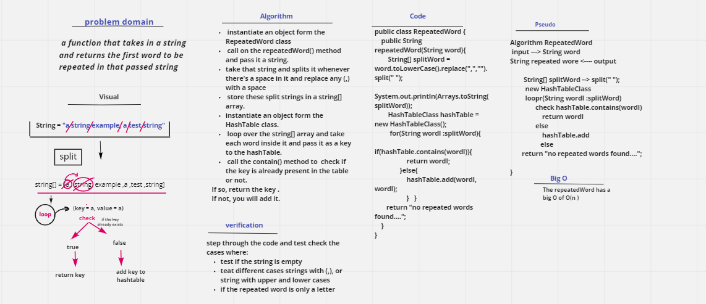

# Challenge Summary
 a function that takes in a string ------> input.
and returns the first word to be repeated in that passed string.<----- output. 

## Whiteboard Process

## Approach & Efficiency
 Big(O)

 - this method has the time complicity of O(n)
 for the fist part of the code it loops over the string that has the split values n times and pass them as keys to the hasTable methods.
 this gives an O(n)
 in the second part of the code, it calls the hashTable which takes an O(1)

 so for the whole code it would be O(n). 

## Solution
first you will` instantiate an object form the RepeatedWord class.` 
then using that object you will call on the `repeatedWord() method` and pass it a string. 

the repeatedWord method will take that string and splits it whenever there's a space in it AKA (" ") and also it will replace any (,) with a space to make sure you will end up with the right results

then it will store these split strings in a string[] array. 
then `instantiate an object form the HashTable class`.
you will loop over the string[] array and take each word inside it and pass it as a key to the hashTable. 
you will  call the` contain() method` that checks if the key is already present in the table or not. 
If so, return the key .
If not, you will add it. 
